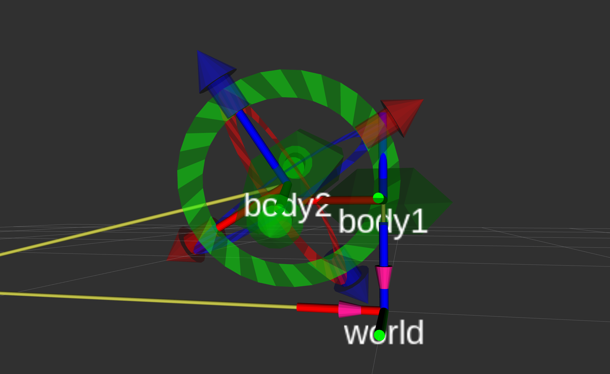

# 3D Collision detection using SAT

A ROS package containing a simple implementation of SAT (Separating Axis Theorem) for collision testing on convex shapes in 3D.

https://en.wikipedia.org/wiki/Hyperplane_separation_theorem#Use_in_collision_detection

This implementation is exposed as a [ROS service](https://github.com/danielcranston/convex_collisions_ros/blob/master/convex_collision_msgs/srv/CheckCollision.srv) that allows the caller to check collisions between two convex bodies.

## Installation
There main code has no external dependencies beyond ROS.

However, to run the demo, you'll need the following:
* `trimesh` (installed via `pip`).
* [rviz_interactive_tf](https://github.com/lucasw/rviz_interactive_tf) (cloned into the workspace and built alongside the packages in this repo).

## Examples
```
roslaunch convex_collision_ros demo.launch demo_type:=box # 'box', 'mesh' or 'ray'
```

### Boxes (`demo_type:=box`)
Note that the possible separating axes are visualized in the `body1` frame. The axes that separate the two bodies are green, and those that don't are red.


### Arbitrary convex shapes (`demo_type:=mesh`)
The visualization of separating axes is disabled for this type, since there are quite a few.



### Ray intersection with convex shape (`demo_type:=ray`)
This one might be a bit of a misnormer (is a ray allowed to be considered a "body"?), but the theory still holds.


## Disclaimer

The code is by no means optimized, instead focus is on brevity and readability. Here are a couple of potential improvements:

* Prune duplicate and degenerate candidate separating axes.
* Separate ROS-specific code and non-ROS implementation into two different packages.
* Don't exhaustively calculate all separating axes candidates, break early if a separating axis is found.
  - Or rather, add an option in the service request so the caller can choose.
* Instead of returning a bool in the service response, return the distance between the bodies (negative if colliding).
* Skip the matrix multiplications transforming body B into body A's frame _if the frames are the same_.
* Implement in a compiled language (C++).
* Parallelize. Each separating axis candidate is independent from all others, both in terms of construction and evaluation.
